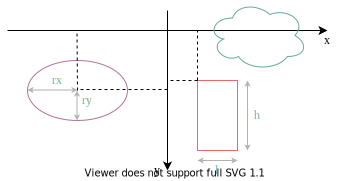

**Sommaire**

[[_TOC_]]

# TD2 : Modélisation de formes géométriques


Nous allons aborder dans ce TD le concept d'héritage de la programmation objet, et l'utilisation de tests unitaires pour améliorer la qualité du logiciel.

Le but de ce TD est de concevoir un module pour manipuler des formes géométriques avec Python. Ce module sera utilisé dans les TDs suivants, donc les tests seront essentiels pour limiter les éventuels bugs. Vous commencerez par définir les classes et leurs attributs, puis implémenterez les méthodes, et les validerez avec des tests.


## Modélisation avec UML (1h)

Les formes géométriques sont représentées par des classes, et l'héritage sera utilisé pour factoriser les propriétés communes. Nous nous limitons à un repère à deux dimensions orthonormé, avec les axes croissant vers la droite et le bas. Les coordonnées dans ce repère sont des entiers relatifs (c'est-à-dire possiblement négatifs). Dans cet espace, nous choisissons de représenter les formes suivantes :

* Les rectangles caractérisés par leur origine (`x`, `y`) et leurs dimensions (`l`, `h`).
* Les ellipses caractérisées par leur origine (`x`, `y`) et leurs rayons aux axes (`rx`, `ry`).
* Un type de forme de votre choix (ex. triangle, polygone, étoile, ...), qui possède au moins une origine (`x`, `y`).

<center></center>

__Exercice 1 -__ Représentez les 3 classes dans un diagramme de classes UML (_voir https://app.diagrams.net pour dessiner en ligne, avec l'onglet UML sur la gauche de l'interface_). Il est recommandé de commencer les noms des classes par une majuscule et les attributs par une minuscule. Les attributs devraient-ils être publics ou privés ?

Les attributs `x` et `y` étant partagés par les trois classes, on introduit l'héritage pour les regrouper. Toutes les formes géométriques hériteront d'une même classe __Forme__. L'intérêt de cette classe est double :

* Du point de vue des développeurs du module, les méthodes dont le code est identique entre formes (ex. translation) sont fusionnées dans __Forme__, réduisant la quantité de code à produire (et donc la multiplication des erreurs possibles).
* Du point de vue des utilisateurs du module, on peut écrire du code qui manipule des rectangles et des ellipses (*p. ex.* système de collisions de formes) sans avoir à écrire du code séparément pour les rectangles et les ellipses. Cet aspect sera illustré dans un prochain TD.

__Exercice 2 -__ Mettez à jour le diagramme UML en incluant la classe __Forme__ et les relations d'héritage. Seuls les attributs seront inclus pour le moment.

Enfin, on vous demande de supporter a minima pour chaque forme les méthodes suivantes :

* `deplacement(dx, dy)`, qui effectue une translation selon un vecteur donné.
* `contient_point(x, y)`, qui renvoie `True` si et seulement si le point donné est à l'intérieur de la forme ou sur sa frontière.
* `redimension_par_points(x0, y0, x1, y1)`, qui redimensionne la forme pour faire correspondre sa [boîte englobante](https://en.wikipedia.org/wiki/Minimum_bounding_rectangle) avec celle représentée par les points donnés.

__Exercice 3 -__ Complétez le diagramme UML avec ces méthodes. Les constructeurs devront également être renseignés (méthode `__init__` en Python), ainsi que les méthodes d'affichage (méthode `__str__` en Python).

__Exercice 4 -__ Écrivez un squelette de code correspondant à votre diagramme UML, dans un fichier _formes.py_. Seuls les constructeurs devront être implémentés. À l'intérieur des autres méthodes, vous mettrez l'instruction `pass` de Python (qui ne fait rien mais vous rappelle que le code est inachevé).


## Implémentation des méthodes (2h)

Créez un fichier _test_formes.py_ dans le même dossier que _formes.py_ et initialisé avec le code suivant :

```python
from formes import *

def test_Rectangle():
    r = Rectangle(10, 20, 100, 50)
    str(r)
    assert r.contient_point(50, 50)
    assert not r.contient_point(0, 0)
    r.redimension_par_points(100, 200, 1100, 700)
    assert r.contient_point(500, 500)
    assert not r.contient_point(50, 50)

def test_Ellipse():
    e = Ellipse(60, 45, 50, 25)
    str(e)
    assert e.contient_point(50, 50)
    assert not e.contient_point(11, 21)
    e.redimension_par_points(100, 200, 1100, 700)
    assert e.contient_point(500, 500)
    assert not e.contient_point(101, 201)

if __name__ == '__main__':
    test_Rectangle()
    test_Ellipse()
```

La commande `assert` de Python permet de spécifier une assertion (une condition qui doit toujours être vraie) à un point du programme. Elle sert avant un bloc de code à en documenter les prérequis, et après un bloc de code à en vérifier les résultats. Son échec signifie alors un bug du programme. `assert` reçoit une expression (comme ce qu'on passe à `if`), et vérifie son résultat :

* Si `True`, l'assertion est vraie donc pas de problème, `assert` ne fait rien.
* Si `False`, l'assertion est fausse donc une exception `AssertionError` est déclenchée.
* Si l'expression renvoie une autre valeur, celle-ci est convertie en booléen pour se ramener aux deux cas précédents.

La vérification de cette condition est faite une fois au moment de son exécution (l'assertion ne sera pas valide dans le reste du programme). Dans _test_formes.py_ on utilise `assert` pour tester une fonctionnalité qui n'est pas encore implémentée, l'exécution de ce fichier échouera tant que les méthodes de seront pas codées. À l'issue de cette partie, elle ne devra renvoyer aucune erreur !

__Exercice 5 -__ Implémentez les méthodes d'affichage (`__str__`) de chacune des classes dans _formes.py_. Vous pourrez vérifier leur bon fonctionnement en exécutant _formes.py_ (bouton Run File - F5), puis par exemple avec une commande `print(Rectangle(0, 0, 10, 10))` dans la console IPython.

__Exercice 6 -__ Implémentez les méthodes d'accès getter/setter pour les champs privés de chacune des classes. Pour vérifier que les champs sont bien privés, le code suivant __doit__ échouer avec une erreur `AttributeError` :

```python
r = Rectangle(0, 0, 10, 10)
print(r.__l, r.__h)
```

__Exercice 7 -__ Implémentez les méthodes `contient_point` des trois sous-classes. Vous vérifierez que les deux premiers `assert` des méthodes de test ne déclenchent pas d'erreur.

__Exercice 8 -__ Implémentez les méthodes `redimension_par_points` de chacune des sous-classes. Le fichier _test_formes.py_ doit à présent s'exécuter sans problème.

## Tests unitaires (1h)

Une fois développées, vos classes vont être utilisées pour des besoins que vous n'aviez pas forcément anticipés. Certains vont révéler des bugs, et vos classes seront amenées à évoluer, y compris pour acquérir de nouvelles méthodes. Les tests unitaires servent à documenter les cas d'utilisation supportés, et également à vous assurer qu'une modification de votre code n'a pas introduit un bug (une _régression_).

On vous fournit une méthode de test plus exhaustive pour __Rectangle__ :

```python
def test_Rectangle():
    r = Rectangle(-20, -10, 40, 20)
    assert r.contient_point(0, 0)
    assert r.contient_point(-20, 0)
    assert r.contient_point(0, -10)
    assert r.contient_point(20, 0)
    assert r.contient_point(0, 10)
    assert not r.contient_point(-40, 0)
    assert not r.contient_point(0, -20)
    assert not r.contient_point(40, 0)
    assert not r.contient_point(0, 20)
    assert not r.contient_point(-40, -20)
    assert not r.contient_point(40, -20)
    assert not r.contient_point(40, 20)
    assert not r.contient_point(-40, 20)
    reference = str(r)
    r.redimension_par_points(-20, 10, 20, -10)
    assert str(r) == reference
    r.redimension_par_points(20, 10, -20, -10)
    assert str(r) == reference
    r.redimension_par_points(20, -10, -20, 10)
    assert str(r) == reference
    r.redimension_par_points(-20, -10, 20, 10)
    assert str(r) == reference
```

__Exercice 9 -__ Exécutez ce test sur votre code, et corrigez les éventuels bugs. Représentez ensuite dans un logiciel de dessin (ex. https://app.diagrams.net/) le rectangle et les positions des points qui sont testés. Quels bugs sont visés par chacun de ces tests ?

La rédaction de tests unitaires consiste souvent à anticiper les bugs courants, pour améliorer la qualité du logiciel dès sa conception. On cherche donc délibérément à provoquer des situations difficiles à gérer (ex. points _sur_ le bord du rectangle). De telles situations sont par exemple :

* le choix de `<` ou `<=` dans le code
* le traitement de valeurs négatives
* les erreurs d'arrondis dans les opérations avec `float`
* la gestion de valeurs nulles (ex. largeur ou hauteur)

__Exercice 10 -__ Dessinez une ellipse dans votre logiciel de dessin, et représentez tous les points qu'il convient de tester avec `contient_point`. Pour chaque point (ou groupe de points), indiquez le type de bug qu'il vise en particulier. Implémentez ces tests dans _test_formes.py_.

__Exercice 11 -__ Dessinez une forme issue de votre troisième classe dans le logiciel de dessin, et choisissez les points qu'il faudra tester. Implémentez une nouvelle méthode de tests pour cette classe dans _test_formes.py_.


## Pour aller plus loin

Lorsque votre programme utilise un grand nombre de tests unitaires, il est possible d'automatiser leur collecte, leur exécution, et l'affichage d'un rapport synthétique. On utilisera alors le module [_pytest_](https://docs.pytest.org/en/stable/) pour Python.

❗ Son installation nécessite que vous ayez installé Anaconda pour l'utilisateur de la machine, et non global au système. Il suffit alors d'ouvrir un terminal d'Anaconda (sous Windows, Menu Démarrer -> Anaconda -> Anaconda Prompt, sous Linux/Mac le terminal de base suffit), et d'y lancer la commande suivante :

```sh
conda install pytest
```

Si vous rencontrez une erreur comme `conda: command not found`, c'est que l'exécutable `conda` n'est présent dans aucun des dossiers visités par le terminal (essayez `echo %PATH%` pour en afficher la liste sous Windows, et `echo $PATH` sous Linux/Mac). Sous Windows, vérifiez que vous ouvrez bien le terminal d'Anaconda (pas le terminal par défaut du système). Sous Linux/Mac, la commande `export PATH=~/anaconda3/bin:/usr/local/anaconda3/bin:/usr/anaconda3/bin:$PATH` va ajouter (temporairement) une liste de répertoires usuels à la liste de recherche.

__Exercice 12 -__ Vérifiez que _pytest_ est installé en exécutant la commande `import pytest` qui ne doit pas renvoyer d'erreur. Ensuite exécutez la commande `pytest.main()`. Combien de fichiers ont été "collectés" ? Combien de tests ont réussi ? Combien ont échoué ?

__Exercice 13 -__ [pytest.raises](https://docs.pytest.org/en/stable/assert.html#assertions-about-expected-exceptions) permet de vérifier qu'un bloc de code déclenche une exception (`raises` ne fait rien si le code échoue, et échoue si le code ne déclenche pas d'exception). Lisez les exemples de la documentation et ajoutez des tests pour vérifier que les variables privées sont inaccessibles de l'extérieur de chaque classe.
