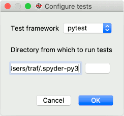
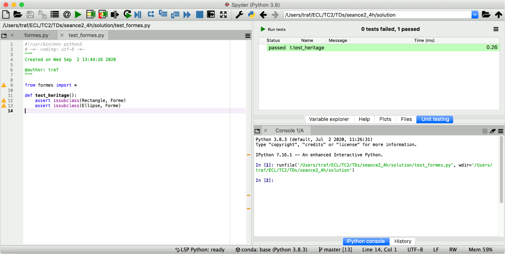

**Sommaire**

[[_TOC_]]

# TD2 : Modélisation de formes géométriques


Nous allons aborder dans ce TD le concept d'héritage de la programmation objet, et l'utilisation de tests unitaires pour guider le développement logiciel et améliorer sa qualité.

Le but de ce TD est de concevoir un module pour manipuler des formes géométriques avec Python. Ce module sera utilisé dans les TDs suivants, donc les tests seront essentiels pour limiter les éventuels bugs. Vous commencerez par définir les classes et leurs attributs, puis par écrire les tests unitaires de votre module, et terminerez par l'implémentation des méthodes.


## Modélisation avec UML (1h)

Les formes géométriques sont représentées par des classes, et l'héritage sera utilisé pour factoriser les propriétés communes. Nous nous limitons à un repère à deux dimensions orthonormé, avec les axes croissant vers la droite et le bas. Les coordonnées dans ce repère sont des entiers relatifs (c'est-à-dire possiblement négatifs). Dans cet espace, nous choisissons de représenter les formes suivantes :

* Les rectangles caractérisés par leur origine (`x`, `y`) et leurs dimensions (`l`, `h`).
* Les ellipses caractérisées par leur origine (`x`, `y`) et leurs rayons aux axes (`rx`, `ry`).
* Un type de forme de votre choix (ex. triangle, polygone, étoile, ...), qui possède au moins une origine (`x`, `y`).

<center></center>

__Exercice 1 -__ Représentez les 3 classes dans un diagramme de classes UML (_voir https://app.diagrams.net pour dessiner en ligne, avec l'onglet UML sur la gauche de l'interface_). Il est recommandé de commencer les noms des classes par une majuscule et les attributs par une minuscule. Les attributs devraient-ils être publics ou privés ?

Les attributs `x` et `y` étant partagés par les trois classes, on introduit l'héritage pour les regrouper. Toutes les formes géométriques hériteront d'une même classe __Forme__. L'intérêt de cette classe est double :

* Du point de vue des développeurs du module, les méthodes dont le code est identique entre formes (ex. translation) sont fusionnées dans __Forme__, réduisant la quantité de code à produire (et donc la multiplication des erreurs possibles).
* Du point de vue des utilisateurs du module, on peut écrire du code qui manipule des rectangles et des ellipses (*p. ex.* système de collisions de formes) sans avoir à écrire du code séparément pour les rectangles et les ellipses. Cet aspect sera illustré dans un prochain TD.

__Exercice 2 -__ Mettez à jour le diagramme UML en incluant la classe __Forme__ et les relations d'héritage. Seuls les attributs seront inclus pour le moment.

Enfin, on vous demande de supporter a minima pour chaque forme les méthodes suivantes :

* `deplacement(dx, dy)`, qui effectue une translation selon un vecteur donné.
* `contient_point(x, y)`, qui renvoie `True` si et seulement si le point donné est à l'intérieur de la forme ou sur sa frontière.
* `redimension_par_points(x0, y0, x1, y1)`, qui redimensionne la forme pour faire correspondre sa [boîte englobante](https://en.wikipedia.org/wiki/Minimum_bounding_rectangle) avec celle représentée par les points donnés.

__Exercice 3 -__ Complétez le diagramme UML avec ces méthodes. Les constructeurs devront également être renseignés (méthode `__init__` en Python), ainsi que les méthodes d'affichage (méthode `__str__` en Python).

__Exercice 4 -__ Écrivez un squelette de code correspondant à votre diagramme UML, dans un fichier _formes.py_. Seuls les constructeurs devront être implémentés. À l'intérieur des autres méthodes, vous mettrez l'instruction `pass` de Python (qui ne fait rien mais vous rappelle que le code est inachevé).


## Tests unitaires (1h)

Il convient à présent de rédiger des tests, qui échoueront tant que chaque fonction ne sera pas implémentée et correcte. Dans la méthodologie _Test Driven Development_, on les écrit toujours avant le code, au début ils échouent tous, et à mesure de l'avancement du projet le nombre de tests passés avec succès augmente. Nous utiliserons le module _pytest_ présenté en cours.

### Installation de _pytest_

Nous allons d'abord installer _pytest_, ainsi qu'un module permettant de lancer les tests depuis l'interface de Spyder. Ouvrez le terminal d'Anaconda (sous Windows, Menu Démarrer -> Anaconda -> Anaconda Prompt, sous Linux/Mac le terminal de base suffit). Exécutez-y la commande suivante :

```sh
conda install -c spyder-ide spyder-unittest pytest
```

❗ Si vous rencontrez une erreur comme `conda: command not found`, c'est que l'exécutable `conda` n'est présent dans aucun des dossiers visités par le terminal (essayez `echo %PATH%` pour en afficher la liste sous Windows, et `echo $PATH` sous Linux/Mac). Sous Windows, vérifiez que vous ouvrez bien le terminal d'Anaconda (pas le terminal par défaut du système). Sous Linux/Mac, la commande `export PATH=~/anaconda3/bin:/usr/local/anaconda3/bin:/usr/anaconda3/bin:$PATH` va ajouter (temporairement) une liste de répertoires usuels à la liste de recherche.

Une fois les modules installés, __redémarrez Spyder__ et créez un fichier _test_formes.py_ avec l'exemple de code suivant :

```python
from formes import *

def test_heritage():
	assert issubclass(Rectangle, Forme)
	assert issubclass(Ellipse, Forme)
```

__Exécutez ce fichier__ dans Spyder (même s'il ne fait rien), ce qui a pour effet d'initialiser le répertoire courant de Spyder à votre répertoire de travail. Allez ensuite dans le menu Run -> Run unit tests, pour configurer le module _spyder-unittest_.

<center></center>


Sélectionnez _pytest_, vérifiez que le dossier indiqué correspond à votre dossier de travail (celui contenant les fichiers _formes.py_ et _test_formes.py_), et validez. Un nouvel onglet _Unit testing_ apparaît dans l'espace en haut à droite, avec un bouton _Run tests_. Lorsque vous cliquez dessus :

* _pytest_ cherche (dans le dossier que vous venez de configurer) tous les fichiers de la forme _test\_\*.py_ et _\*\_test.py_.
* Dans chacun de ces fichiers, _pytest_ exécute toutes les fonctions préfixées par `test`.
* Chaque test qui s'exécute sans déclencher d'exception est considéré valide.
* La fonction `test_heritage` dans le fichier _test_formes.py_ correspond à ces critères, donc elle est exécutée et son résultat contribue à un test "passé" (avec succès).

<center></center>

### Définition des tests

__Exercice 5 -__ Dans le fichier _test_formes.py_, ajoutez une fonction `test_Rectangle_contient_point()` qui instancie un __Rectangle__ avec des coordonnées de votre choix, et vérifie avec `assert` que la méthode `contient_point` renvoie le bon résultat pour différentes coordonnées. L'exécution du test doit échouer puisque votre code est encore vide.

Pour l'exercice suivant, on vous donne un exemple d'implémentation de la méthode `contient_point` pour la classe __Rectangle__. La classe __Forme__ a été omise pour réduire la taille du code (mais dans votre fichier elle devra bien être présente).

```python
class Rectangle:
	def __init__(self, x, y, l, h):
		self.x = x
		self.y = y
		self.__l = l
		self.__h = h
	
	def contient_point(self, x, y):
		return self.x < x < self.__l or \
		       self.y < y < self.__h
```

__Exercice 6 -__ Cette méthode est buggée. Comment la corriger ? Vos tests l'avaient-ils repéré ? Si ce n'est pas le cas, trouvez les coordonnées qui donnent un mauvais résultat et ajoutez-les en tests dans la fonction `test_Rectangle_contient_point`.


## Implémentation des méthodes (2h)

__Exercice 7 -__ Implémentez les méthodes d'affichage (`__str__`) de chacune des classes. Il ne sera pas nécessaire d'écrire des tests pour ces méthodes.

__Exercice 8 -__ Implémentez les méthodes d'accès getter/setter pour les champs privés de chacune des classes. À l'aide de [pytest.raises](https://docs.pytest.org/en/stable/assert.html#assertions-about-expected-exceptions), vous testerez le déclenchement d'erreurs si on essaie d'accéder directement aux attributs.

__Exercice 9 -__ Implémentez les méthodes `contient_point` des deux sous-classes restantes. Vous fournirez pour chacune une fonction de tests avec des jeux de coordonnées pertinents.

__Exercice 10 -__ Implémentez les méthodes `redimension_par_points` de chacune des sous-classes. Vous fournirez également des tests validant leur fonctionnement quels que soient les points en entrée.
