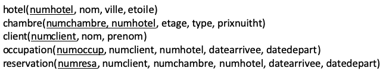
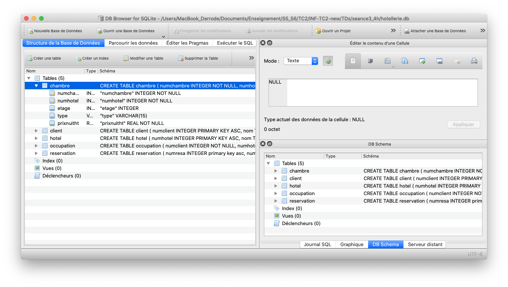

**Sommaire**

[[_TOC_]]

# BE #3 : Base de données SQL

L'objectif de ce BE est d'expérimenter la manipulation (créer, lire, interroger, modifier) de bases de données relationnelles avec le langage SQL (*Structured Query Language*), à partir de Python. Le BE est décomposé en trois parties:

  1. **La première partie** (durée: 45 min.) présente quelques commandes élémentaires pour interroger une base SQL à partir de Python;
  1. **La seconde partie** (durée: 75 min.) permet de découvrir comment manipuler une base de données SQL avec Python. L'énoncé est rédigé sous une forme tutoriel;    
  1. **La troisième partie** (durée: 120 min. et +) constitue un travail plus personnalisé qui vous permettra de mettre à profit vos connaissances sur la programmation par tests, la gestion des exceptions, la librairie graphique *matplotlib* et bien sûr les bases de données SQL. 

Ce BE fera l'objet d'un compte-rendu (CR), seul ou en binôme. Avant de commencer, veuillez prendre connaissance des consignes concernant le rendu du travail (à respecter scrupuleusement) qui se trouvent dans le fichier [consignes_BE#3.md](./consignes_BE#3.md) (dans le même répertoire que cet énoncé).


## 1. Mini-tutoriel sur la base Hotellerie.db (45 min.)

Le système de gestion de base de données qui sera utilisé pour la suite de ce BE est ``SQLite``. Ce système très simple fonctionne en stockant une base de données dans un fichier unique au format ``.sqlite``. La base de tests utilisée dans cette partie s'appelle *hotellerie.db* ; elle est disponible au même endroit que cet énoncé.

Le schéma de la base de données est le suivant:

<center></center>

La base est composée de 5 tables, ces tables étant composées d'un nombre variable de champs. Les champs soulignés représentent les clés primaires (ou *primary key (PK)* en anglais). En particulier, la clé primaire de la table **chambre** est composée des attributs *numchambre* et *numhotel* (cette dernière étant la clé primaire de la table **hotel**).
 

*Remarque* : Vous trouverez [ici, une vidéo](https://www.youtube.com/watch?v=VgTRNqn2fn0) qui montre comment utiliser [draw.io](https://app.diagrams.net) pour créer un diagramme entité-association. Il NE vous est PAS demandé de dessiner le diagramme de cette base de données.


### 1.1 DB browser for SQLite (30 min.)

Toutes les opérations sur une base de données de ce type peuvent être effectuées en Python via les classes et les méthodes  présentes au sein du module ``sqlite3``. Pour manipuler de manière interactive le contenu de la base (créer, supprimer ou modifier des tables et des enregistrements, effectuer des requêtes SQL...), il existe des outils adaptés. L'outil retenu dans le cadre de ce cours s'appelle ``DB Browser for SQLite``. C'est un logiciel libre qui existe pour toutes les plate-formes : Windows, MacOs, nombreuses distributions Linux et Unix...

 - Téléchargez et installez [DB Browser for SQLite](https://sqlitebrowser.org/) en suivant les instructions d'installation en fonction de votre système d'exploitation.    
 - Ouvrez la base *hotellerie.db* et naviguez dans les tables (onglet ``Structure de la Base de Données``) et les enregistrements (onglet ``Parcourir les données``) pour prendre connaissance de la base (telle qu'elle est schématisée dans la figure ci-dessus).

<center></center>

 - Dans l'onglet ``Exécuter le SQL``, lancez la requête suivante   
```SQL
SELECT nom, ville
FROM hotel;
```  
La réponse apparaît sous forme de 12 lignes. Ça vous rappelle des choses ? Si non, alors voici quelques pointeurs pour vous rafraîchir la mémoire:    
    - [cours tutoriel sur SQL](https://www.1keydata.com/fr/sql/)  
    - [SQL : sélection, jointure, regroupement, filtre](http://cerig.pagora.grenoble-inp.fr/tutoriel/bases-de-donnees/chap20.htm)
    - et tant d'autres...


### 1.2 Quelques requêtes Python (15 min.)

Nous allons maintenant chercher à reproduire la requête en utilisant Python et le package  ``sqlite3``.  C'est une librairie objet dont la [documentation](https://docs.python.org/3/library/sqlite3.html#module-sqlite3) fournit une description des classes et des méthodes disponibles. Suivez le guide...

Le squelette typique d'un tel programme s'écrit: 
```python
import sqlite3
if __name__ == '__main__':
	conn = sqlite3.connect('hotellerie.db') # connexion à la bdd
	# travail sur la bdd à partir du connecteur
	conn.commit()                           # pour enregistrer les éventuels changements 
	conn.close()                            # pour fermer proprement l'accès à la base
```

Ainsi, pour obtenir la réponse à la requête précédente:
```python
import sqlite3
if __name__ == '__main__':
	conn = sqlite3.connect('hotellerie.db')

	curseur = conn.cursor()                          # objet permettant de faire des requêtes
	curseur.execute("SELECT nom, ville FROM hotel;") # requête SQL
	ligne1 = curseur.fetchone()                      # 1ère ligne résultat de la requête
	print('ligne1 =', ligne1)
	ligneAll = curseur.fetchall()                    # toutes les lignes de la requête
	print('ligneAll =', ligneAll)

	conn.close() 
```

Copiez et exécutez ce programme ; le résultat se présente sous forme d'un tuple, ou sous forme d'une liste de tuples. Ainsi la commande 
```python
print(ligneAll[0][0])
```
imprime le nom du premier hôtel qui apparaît dans la liste des résultats de la requête.

Voici un usage intéressant à étudier:
```python
import sqlite3
if __name__ == '__main__':
	conn = sqlite3.connect('hotellerie.db')

	curseur = conn.cursor()  
	for ligne in curseur.execute("SELECT * FROM hotel WHERE etoiles=3"):
		print('ligne=', ligne)
	
	conn.close() 
```

-----

## 2. Classe HotelDB (75 min.)

Il s'agit de créer une classe **HotelDB** permettant de réaliser un certain nombre de requêtes et de mises à jour de la base *Hotellerie.db*. 

### 2.1 Requête en lecture (30 min.)

Dans un fichier *HotelDB.py*, commencez à développer la classe permettant de répondre à ce programme principal dont l'objectif est d'afficher le nom des hôtels 2 étoiles (noter que le nombre d'étoiles est passé en argument):
 ```python
 if __name__ == '__main__':
	aHotelDB =  HotelDB('hotellerie.db')
	print(aHotelDB.get_name_hotel_etoile(2))
 ```   
*Remarque* : Pour fermer correctement l'accès à la base de donnée, pensez à implémenter la méthode ``__del__(self)`` (vue en cours), qui est appelée automatiquement par Python lorsque l'objet est détruit.

*Améliorations* : Comment se comporte votre programme si on insère dans le programme ci-dessus la commande ``print(aHotelDB.get_name_hotel_etoile(-1))``? Et la commande ``print(aHotelDB.get_name_hotel_etoile("Hello"))``. Comment éviter que cet usage ne produise la fin brutale du programme et renvoie une liste vide tout simplement? 

### 2.2 Requête en écriture (45 min.)

Créer une requête permettant d'ajouter un nouveau client. Si le client existe déjà (même nom ET même prénom), la méthode renverra le numéro de ce client. Si le client n'existe pas, alors la méthode créera un nouveau client, en lui adjoignant le premier numéro non encore utilisé (c'est une clé primaire !). Pour cela, renseignez-vous sur la commande ``INSERT INTO``. Vérifier que le nouveau client a bien été sauvegardé dans le fichier *Hotellerie.db*:     

  - soit en consultant la base avec ``DB Browser for SQLite``;
  - soit en exécutant par 2 fois le même programme, vous devriez retrouver le même numéro de client.


-----


## 3. Requêtes libres (120 min. et +)

Dans cette dernière partie, nous vous invitons à imaginer et implémenter **DEUX (2)** requêtes originales à partir de la bdd *Hotellerie.db*, ou de tout autre bdd que vous aurez trouvée sur Internet. Voici un exemple de site proposant des bdd SQL gratuites (il y en a beaucoup d'autres) : [bases-donnees-gratuites](https://sql.sh/categorie/bases-donnees-gratuites). Dans le second cas, n'oubliez pas d'inclure cette base dans votre archive, et de préciser dans votre rapport le chemin pour la télécharger.

*Quelques conseils*:

* Imaginez deux requêtes originales à partir de la base que vous avez sélectionnée. N'hésitez pas à visiter un site de réservation d'hôtels pour trouver des idées de requêtes intéressantes.
* Concevez des exemples de requêtes ainsi que les résultats qu'elles doivent renvoyer (il est recommandé de les rédiger sous forme de tests unitaires). 
* Implémentez les méthodes gérant vos deux requêtes (éventuellement dans une nouvelle classe calquée sur le modèle de la classe **HotleDB** si vous décidez d'utiliser une seconde bdd).

Les deux requêtes doivent être relativement sophistiquées (pas de simples ``select ... from``), l'évaluation de cette partie dépendra :

 - de l'originalité de vos requêtes, et 
 - de la valorisation graphique des résultats de vos requêtes à l'aide de la librairie **matplotlib**. 
 - de leur présentation dans le rapport.

À titre d'exemples, vous trouverez, à côté de cet énoncé, un fichier nommé ``ex_matplotlib.py``. L'exécution de ce script génère 4 figures dans le répertoire *figures*. Inspirez-vous largement de ce programme pour vos propres figures. *Conseil*: Évitez de vous lancer dans des requêtes avec des données géographiques, genre ```trouver tous les hôtels à moins de 5 kilomètres``` car l'usage de cartes géographiques dépasse les attentes de ce qui est demandé ici.


