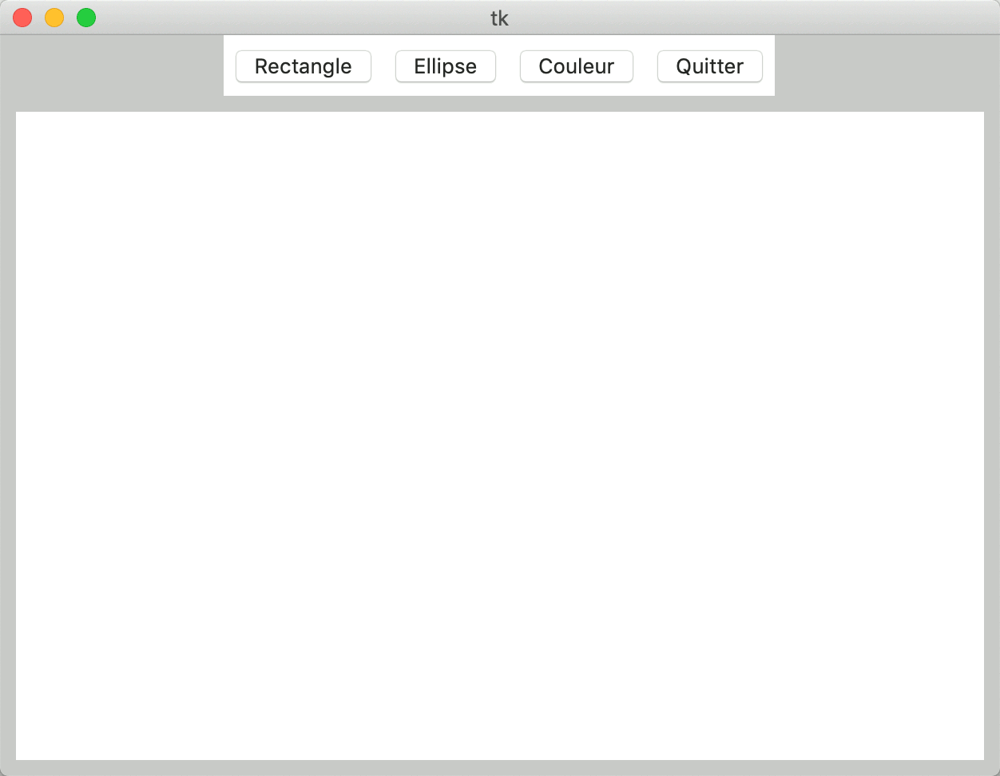
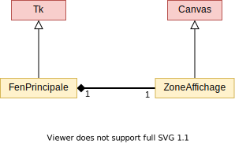
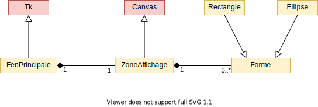

**Sommaire**

[[_TOC_]]

# BE #4 : Application de dessin vectoriel


L'objectif de ce TD est d'apprendre à manipuler quelques composants du module Python _Tkinter_ permettant de créer des interfaces graphiques. Vous allez créer une application simple de dessin vectoriel, qui permettra de tracer à la souris les formes définies dans le BE #2.

## Quelques éléments de Tkinter (45 min.)

Le module _Tkinter_ (_"Tk interface"_) permet de créer des interfaces graphiques. Il contient de nombreux composants graphiques (ou _widgets_), tels que les boutons (classe __Button__), les cases à cocher (classe __CheckButton__), les étiquettes (classe __Label__), les zones d'entrée de texte (classe __Entry__), les menus (classe __Menu__), ou les zones de dessin (classe __Canvas__).

Durant ce BE, nous vous recommandons de conserver la [documentation de _Tkinter_](http://effbot.org/tkinterbook/) ouverte dans un onglet. Elle contient des exemples de code qui vous seront utiles pour utiliser chacun des _widgets_.

Voici un premier exemple de code _Tkinter_ :

```python
import random
from tkinter import *

def tirage():
    nb = random.randint(1, 100)
    texteResultat.set('Nombre : ' + str(nb))

if __name__ == '__main__':
    
    # création de l'arbre de scène
    racine = Tk() # Appel à une méthode de classe (et non un constructeur, cf slide cours #2)
    racine.title('Tirage aléatoire')
    racine.geometry('300x100+400+400')
    
    # Les widgets de la scène
    boutonLancer = Button(racine, text='Tirage')
    boutonLancer.pack(side=LEFT, padx=5, pady=5)
    texteResultat = StringVar()
    labelResultat = Label(racine, textvariable=texteResultat)
    labelResultat.pack(side=LEFT, padx=5, pady=5)
    boutonQuitter = Button(racine, text='Quitter')
    boutonQuitter.pack(side=LEFT, padx=5, pady=5)

    # association des commandes aux widgets
    boutonLancer.config(command=tirage) # appel dit callback (pas de parenthèses)
    boutonQuitter.config(command=racine.quit) # idem
    racine.mainloop() # affichage de l'interface jusqu'à quit
```


__Exercice 1 -__ Copiez le code suivant dans un fichier appelé *Exo1.py* et exécutez-le pour observer le résultat. 

__Attention, utilisateurs de Mac__ : l'association _Spyder_+_Tkinter_ ne fonctionne pas bien sous Mac! Lorsque vous quitterez l'interface (par le biais du bouton _quitter_), la fenêtre va se bloquer (_freeze_). Deux solutions: 

 - soit vous forcez l'application à s’arrêter à chaque fois (utilisez le menu contextuel sur l'icône de l'application concernée dans la barre d'outils);
 - soit vous exécutez votre programme en ligne de commande. Pour cela, ouvrez un terminal dans le répertoire de travail (clic-droit dessus → Nouveau terminal au dossier). Puis lancer la commande : `python3 Exo1.py`. Vous devriez pouvoir quitter l'application sans difficulté. N'oubliez pas de sauvegarder votre fichier sous _Spyder_ avant toute exécution!

Prenez le temps d'étudier cet exemple, et répondez aux questions suivantes :

* Combien d'éléments contient l'arbre de scène ?
* Que se passe-t-il lorsqu'on clique sur le bouton ?
* Comment peut-on inverser les positions des deux boutons ?
* Comment peut-on augmenter l'espace à gauche et à droite du label ?
* Comment peut-on colorier le texte du label en rouge ?


## Squelette de l'application de dessin (45 min.)

On souhaite obtenir l'interface ci-dessous, dans laquelle les utilisateurs sélectionneront le type de forme à dessiner avec les boutons, et créeront une forme en cliquant dans la zone située sous la barre d'outils (_widget_ __Canvas__ de _Tkinter_). On a donné une couleur grise au fond de la fenêtre pour vous aider à déterminer les widgets présents.

<center></center>

__Exercice 2 -__ Dessinez l'arbre de scène correspondant à cette capture d'écran.

Une pratique courante dans les interfaces graphiques est de créer des classes qui _remplacent_ des nœuds de l'arbre de scène, et d'y mettre le code de l'application. Ces classes héritent des classes de _Tkinter_ (pour pouvoir les remplacer dans l'arbre), et nous leur ajouterons des attributs et méthodes spécifiques à leurs responsabilités dans l'application de dessin. Nous allons ainsi introduire deux classes :

* la classe __ZoneAffichage__, qui hérite de __Canvas__ et gère toutes les opérations de dessin spécifiques à votre application.
* la classe __FenPrincipale__, qui hérite de __Tk__ et gère l'initialisation de l'arbre de scène et des _callbacks_ des widgets.

Voici le diagramme UML correspondant :

<center></center>

__Exercice 3 -__ Complétez le code ci-dessous avec l'initialisation de votre arbre de scène. Vous utiliserez une instance de __ZoneAffichage__ à la place de __Canvas__. À ce stade, on ne vous demande pas de programmer les actions, uniquement de mettre en place le design de l'interface. Vous trouverez des exemples d'utilisation de chacun des widgets dans la documentation référencée plus haut.

```python
from tkinter import *

class ZoneAffichage(Canvas):
    def __init__(self, parent, largeur, hauteur):
        Canvas.__init__(self, parent, width=largeur, height=hauteur)

class FenPrincipale(Tk):
    def __init__(self):
        Tk.__init__(self)
        # L'initialisation de l'arbre de scène se fait ici

if __name__ == "__main__":
    fen = FenPrincipale()
    fen.mainloop()
```


## Dessin de formes dans le canevas (60 min.)

Vous trouverez dans le dossier de ce BE le fichier [formes.py](formes.py) développé durant le BE #2. Nous avons agrémenté les classes __Rectangle__ et __Ellipse__ pour qu'elles reçoivent un canevas en argument et se dessinent dessus lors de leur initialisation. Téléchargez ce fichier dans votre répertoire de travail.

Les classes seront intégrées selon le diagramme UML suivant :

<center></center>

__Exercice 4 -__ Créez une méthode `ajout_forme(..., x, y)` dans __ZoneAffichage__ qui crée un __Rectangle__ dont le centre sera donné par les 2 arguments _x_ et _y_, de largeur 10 et de hauteur 20. N'oubliez pas de stocker ce rectangle dans __ZoneAffichage__ !

__Exercice 5 -__ À l'aide de la méthode `bind` vue en cours, reliez les clics de souris sur le canevas (évènements `<ButtonRelease-1>`) à la méthode `ajout_forme`. Attention, pour utiliser une méthode comme fonction de _callback_, il faut la précéder de `self.`.

__Exercice 6 -__ Ajoutez un attribut à __ZoneAffichage__ qui stocke le type de forme actuellement sélectionné, et associez les boutons Rectangle/Ellipse au type de forme qui est dessiné lorsqu'on clique dans le canevas.


## Quelques opérations de dessin supplémentaires (90 min.)

Nous allons à présent intégrer quelques commandes simples dans l'application de dessin :

* Lorsqu'on clique sur une forme en maintenant la touche CTRL enfoncée, elle doit être effacée du canevas.
* Lorsqu'on déplace la souris avec le bouton enfoncé sur une forme, on déplace la forme en même temps que la souris.
* Lorsqu'on clique sur le bouton _Couleur_, un sélecteur de couleur apparaît pour choisir la couleur de l'outil de dessin.

__Exercice 7 -__ Implémentez l'effacement des formes avec CTRL-clic (événement `<Control-ButtonRelease-1>`). Vous pourrez faire appel aux méthodes `contient_point(...)` des classes __Rectangle__ et __Ellipse__ pour déterminer si la position de la souris au moment de l’événement est dans le périmètre d'une forme donnée, ainsi qu'à la méthode `effacer(...)` de la classe __Forme__.

__Exercice 8 -__ À l'aide du module _colorchooser_ de _Tkinter_ (```from tkinter import colorchooser```), liez les clics sur le bouton Couleur à l'affichage d'un sélecteur de couleur, et utilisez la couleur renvoyée pour tous les ajouts de formes suivants.

__Exercice 9 -__ À l'aide des types d’événements `<Button-1>`, `<B1-Motion>` et `<ButtonRelease-1>`, implémentez la translation des formes lors des actions d'appui-déplacement de la souris. Comment faire pour qu'elles n'interfèrent pas avec la création de nouvelles formes ?


## Exercices bonus

Il n'y a pas d'ordre prédéfini pour ces trois exercices supplémentaires, choisissez celui dont la fonctionnalité vous semble la plus intéressante.

__Bonus 1 -__ Durant le BE #2 vous avez conçu un troisième type de forme. Il est temps de l'intégrer à votre application de dessin ! Inspirez-vous du code du fichier _formes.py_ de ce BE pour adapter la classe que vous aviez développée. Vous trouverez également les instructions de dessin dans la documentation de Tkinter sur __Canvas__.

__Bonus 2 -__ Maintenant que votre programme de dessin vectoriel est fonctionnel, il devrait être possible d'exporter chaque image produite dans un fichier. On utilise pour cela le format SVG, qui est un fichier texte contenant des instructions de dessin. Il suffit d'écrire `<svg width=600 height=400 xmlns=http://www.w3.org/2000/svg>` au début du fichier, `</svg>` à la fin, et d'insérer des balises [`rect`](https://developer.mozilla.org/fr/docs/Web/SVG/Element/rect) et [`ellipse`](https://developer.mozilla.org/fr/docs/Web/SVG/Element/ellipse) entre les deux. C'est à vous !

__Bonus 3 -__ Dans tout programme de dessin respectable, on doit pouvoir dessiner des formes de tailles arbitraires (pas prédéfinies). À l'aide des types d’événements `<Button-1>`, `<B1-Motion>` et `<ButtonRelease-1>`, faites qu'un mouvement de souris avec le bouton enfoncé dessine une forme en tirant ses coins (lorsqu'il ne déplace pas une forme existante). Vous utiliserez les méthodes `redimension_par_points` des classes __Rectangle__ et __Ellipse__.
