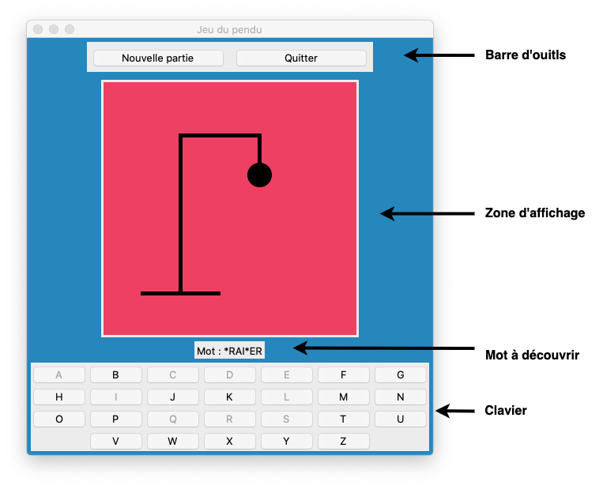
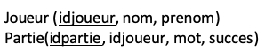

**Sommaire**

[[_TOC_]]

# BE #5 : Le jeu du Pendu

L'objectif de ce BE est de réaliser le ``jeu du Pendu``. Pour rappel, ce jeu consiste à essayer de découvrir un mot qui est affiché de manière masquée (chacune de ses lettres est remplacée par le caractère _'*'_). Pour cela, le joueur sélectionne une lettre sur le clavier virtuel. Si elle fait partie du mot, alors le mot à découvrir est ré-affiché en laissant apparaître cette lettre en clair. Si par contre le mot ne contient pas la lettre sélectionnée, alors le compteur de coups ratés augmente d'un et l'élément suivant du pendu est ajouté au dessin. Le joueur gagne s’il a pu découvrir le mot avant que le pendu ne soit complètement affiché (au delà de 10 coups manqués). La figure ci-dessous présente l'interface que nous allons construire ; oui, les couleurs piquent un peu aux yeux, mais ça pourra vous aider à répondre à la première question!

<center></center>

Nous allons vous accompagner dans le développement de ce logiciel. La première partie (90 minutes) porte sur la mise en place de l'interface graphique. La seconde (75 minutes) porte sur la logique du jeu, à partir des commandes associées au bouton _Nouvelle Partie_ et aux Boutons-lettres. La troisième partie met en place le dessin du pendu (75 minutes). La dernière partie propose de développer des fonctionnalités supplémentaires à notre application durant l'autonomie (avec une question _Bonus_ pour les plus téméraires!).

Ce BE fera l'objet d'un compte-rendu (CR), seul ou en binôme. L'énoncé correspond à 4h encadrées et 2h d'autonomie. Avant de commencer, veuillez prendre connaissance des consignes concernant le rendu du travail (à respecter scrupuleusement) qui se trouvent dans le fichier [consignes_BE#5.md](./consignes_BE#5.md), dans le même répertoire que cet énoncé.

---    

## Partie 1 - Mise en place de l'interface statique (90 min.)

__Exercice 1 -__ Dessinez l'arbre de scène correspondant à la capture d'écran ci-dessus.    

__Exercice 2 -__ En vous inspirant de l'organisation des classes du BE #4, programmez l'interface statique (_i.e._ sans commande) en distinguant la classe __FenPrincipale__ et la classe __ZoneAffichage__. À ce stade, à la place des 26 boutons du clavier (correspondant aux 26 lettres en majuscule), placez un simple bouton _"A"_ (le dessin du clavier est traité dans l'exercice suivant).

Testez votre interface et faites les ajustements nécessaires pour obtenir une apparence proche de celle donnée en exemple (mais sans le clavier, et avec les couleurs qui vous conviennent !). Le programme principal se réduira à ces quelques lignes:
```python
if __name__ == '__main__':
	fen = FenPrincipale()
	fen.mainloop()
```

_Remarque_ : Vous pouvez à ce stade ajouter la commande _self.destroy_ sur le bouton _Quitter_.


__Exercice 3 -__ Nous allons maintenant dessiner le clavier tel qu'il apparaîtra dans la version finale.

  1. __Liste des boutons__ Les 26 boutons seront créés et stockés dans une liste de boutons. Pour transformer les nombres de 0 à 25 en lettres  _A_, ..., _Z_, vous pourrez utiliser l'instruction suivante ```t = chr(ord('A')+i)``` qui transforme l'entier _i=0_ en la chaîne d'un caractère _t="A"_, l'entier _i=1_ en la chaîne d'un caractère _t="B"_, ...    
  1. __Placement des boutons__ La disposition des boutons en grille sera réalisée grâce à la commande _grid_, selon l'exemple suivant : ```unBouton.grid(row=1, column=2)``` positionne _unBouton_ sur la première ligne, seconde colonne de la grille (dont la taille s'adapte automatiquement).

Pensez à exécuter votre programme pour vérifier le placement du clavier virtuel.


## Partie 2 - Logique de jeu, commandes (75 min.)

 Cette partie est destinée à implémenter la logique de jeu, à travers les commandes de l'interface:

  - _Bouton "Quitter"_ (normalement, c'est déjà fait avec l'appel à la méthode _destroy_!)
  - _Bouton "Nouvelle partie"_
  - _Boutons-lettres "A", ..., "Z"_

On fait ici abstraction de la représentation graphique du pendu qui sera traitée dans la partie suivante de cet énoncé. Allons-y pas-à-pas...

### Bouton "Nouvelle Partie" (30 min.)

Une partie ne pourra commencer que si le joueur appuie sur le bouton "Nouvelle partie".

__Exercice 4 -__ L'appuie sur ce bouton doit provoquer une ré-initialisation de toute l'interface: 

  - Tirer un nouveau mot au hasard dans le fichier [mots.txt](./mots.txt) (à votre disposition à côté de cet énoncé) et réinitialiser le mot à découvrir;   
  - Dégriser les boutons-lettres (```state=NORMAL```);    
  - Effacer le dessin du pendu (question traitée dans la partie suivante de cet énoncé).

_Quelques conseils pour l’implémentation_

  - Au chargement de l'application, pensez à griser toutes les lettres du clavier. 
  - Utilisez la méthode suivante pour charger les mots du fichier _mots.txt_ dans une liste privée appelée _self.\_\_mots_. Cette liste sera chargée un fois pour toute au lancement de l'application, et utilisée à chaque nouvelle partie.   
```python
def chargeMots(self):
	f = open('mots.txt','r')
	s = f.read()
	self.__mots = s.split('\n')
	f.close()
```   
  - Pour tirer un nouveau mot, utilisez la fonction _randint(...)_ (```from random import randint```).

<!--
_Tip_ Vous pouvez créer des attributs différents pour sauvegarder 

  - le mot à deviner et     
  - le mot à deviner mais partiellement caché par des étoiles (celui qui sera affiché sur l'interface pour le joueur).
-->

Pensez à vérifier que votre application est bien fonctionnelle à ce stade.


### Boutons-lettres "A", ..., "Z" (45 min.)

Appuyer sur une lettre du clavier virtuel doit provoquer un certain nombre d'actions :
 
   - griser le bouton-lettre qui vient d'être cliqué (```state=DISABLED```);    
   - faire apparaître autant de fois que nécessaire la lettre cliquée dans le mot à découvrir;  
   - vérifier si la partie est perdue, gagnée, ou si elle se poursuit;      
   - éventuellement, compléter le dessin du pendu si la lettre n'est pas présente dans le mot (question traitée dans la partie suivante de cet énoncé).

Chaque bouton doit pouvoir être identifié par la fonction de _callback_ appelée ici _cliquer_. Or il n'est pas possible de passer le numéro du bouton-lettre au _callback_ (aucun argument n'est admis). Nous allons procéder en créant notre propre classe de  boutons, héritant de la classe __Button__.

__Exercice 5 -__ Suivez les étapes proposées

  1. Créez la classe __MonBoutonLettre__, qui hérite de la classe __Button__, et qui sauvegarde, en tant qu'attribut privé, la lettre correspondant au bouton (ou le numéro du bouton).  Modifiez en conséquence le constructeur de la classe __FenPrincipale__ pour que le clavier virtuel soit composé de 26 instances de la classe __MonBoutonLettre__. 
  1. Créer la fonction de callback _cliquer(self)_ dans la classe __MonBoutonLettre__, qui fera notamment appel à la méthode _traitement(...)_ de la classe __FenPrincipale__.    
  1. Programmez la méthode _traitement(...)_ dont l'objectif est de mettre à jour l'affichage du mot.    
    - Si la partie est gagnée, bloquez l'utilisation du clavier, et affichez un texte qui indique au joueur que c'est gagné!  
    - La partie est perdue quand le nombre de coups dépasse 10 (c'est le nombre d'éléments pour dessiner entièrement le pendu). Bloquez alors l'utilisation du clavier, et affichez un texte qui indique au joueur que c'est perdu!  

À ce stade, l'application doit être entièrement fonctionnelle, seul le dessin du pendu est manquant, ce que nous allons compléter dès à présent...


## Partie 3 - Le dessin du pendu (75 min.)

Cet partie est consacrée au dessin progressif du pendu, au fur et à mesure des échecs du joueur. Ce dessin s'appuie sur les connaissances acquises lors du BE #4 et les classes du fichier [formes.py](./formes.py), disponible à côté de cet énoncé (c'est le même que celui utilisé dans le BE #4). 

__Exercice 6 -__

Pour cela, l'idée est de créer le pendu comme une liste de rectangles et d'ellipses (10 pièces doivent suffire), dans le constructeur de la classe __ZoneAffichage__. Pour faire disparaître le pendu (au moment de la création des picèces, ou au moement de la réinitialisation d'une partie p. ex.), on affectera aux pièces la couleur de fond du canevas. Pour faire apparaître les pièces progressivement (sur ordre de la méthode _traitement(...)_), on leur affectera une couleur différente.


## Partie 4 - Améliorations du jeu (autonomie)

Voici quelques améliorations possibles pour le jeu, seule la dernière est considérée comme un bonus.

__Exercice 7 - Apparence__ Développez le code qui permet au joueur de choisir les couleurs principales de l’application (par menus, boutons...).

__Exercice 8 - Bouton Triche__ Implémentez un bouton "Triche" qui permet de revenir en arrière d'un coup en cours de partie.

__Bonus - Score joueur__ Implémentez un système de sauvegarde des parties jouées par un joueur (identifié par son nom et son numéro) ? Techniquement, on pourra créer une base de données SQL (BE #3), appelée _pendu.db_, qui stockera une table avec les joueurs et une table avec les parties jouées par ces joueurs, selon le schéma suivant:

<center></center>

_Remarque_ : on ne demande pas ici d'afficher un historique ou des statistiques sur un joueur. Pour consulter la base, on pourra simplement utiliser ```DB Browse for SQLite```.
